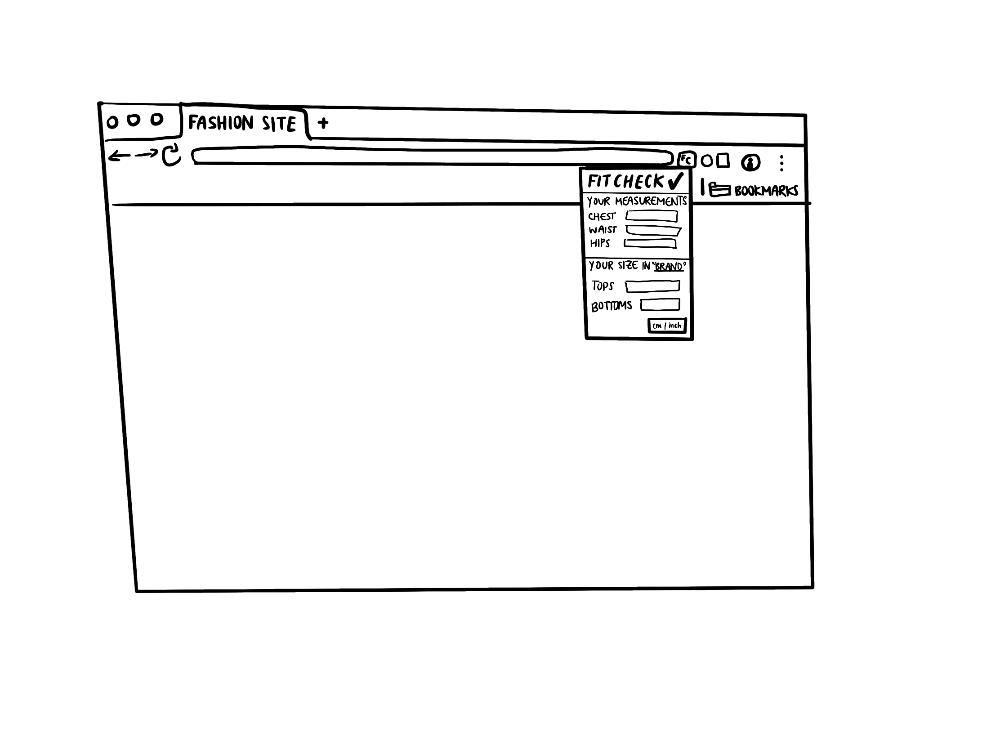

# FitCheck: Sizing Simplified

## Overview

FitCheck is a Google Chrome Extension that allows users to input and store their clothing measurements. When shopping on fashion websites, the extension automatically analyzes the site's sizing information and recommends the best size for the user based on their stored measurements.

### Problem

This is a problem that I have faced myself. Online clothing shopping often results in ill-fitting purchases due to inconsistent sizing across brands. This leads to customer frustration, increased returns, and environmental waste. FitCheck aims to solve this problem by providing personalized size recommendations based on the user's actual measurements and each brand's specific sizing.

### User Profile

FitCheck is designed for online shoppers who frequently buy clothing from various brands online. Users will input their measurements once (or whenever they choose to update it) and then rely on the extension for size recommendations while browsing different fashion websites.

### Features

1. User can input and store personal body measurements (chest, waist, hips)
2. Extension automatically detects when user is on a supported fashion website
3. FitCheck scans the website for sizing information
4. Extension provides a size recommendation based on the user's measurements and the website's size chart
5. Users can update their measurements at any time
6. FitCheck supports multiple types of clothing (tops, bottoms, dresses, etc.)
7. Extension provides a confidence level for each recommendation

## Implementation

### Tech Stack

- HTML/CSS/Javascript for the extension's user interface
- Node.js for potential backend services
- MongoDB or mySQL for data storage (if needed)
- Chrome Extension APIs for browser integration
- TensorFlow.js for image recognition of size charts (potentially)

### APIs

- Chrome Storage API for saving user data
- Chrome Tabs API for interacting with browser tabs
- Potential integration with fashion retailer APIs for more accurate size data

### Sitemap

1. Popup Interface
    - Measurement Input Form
    - Settings Page
2. Size Recommendation Overlay (appears on supported websites)

### Mockups

### Data

- User Measurements: {userId, chest, waist, hips, inseam, ...}
- Size Charts: {brandId, garmentType, sizeData: [{size, measurements}, ...]}
- User Preferences: {userId, preferredFit, unitSystem, ...}

### Endpoints

Not applicable. Since I am creating a Chrome extension, this project will primarily operate client-side. If I do end up expanding my scope to include a backend, potential endpoints could include:
    - GET /api/sizechart/:brandId to retrieve a size chart for a specific brand
    - POST /api/user/measurements to save user measurements

### Auth

Initially, the extension will use Chrome's storage API to save user data locally. If I do expand my scope to include a backend, I would implement OAuth 2.0 for user authentication.

## Roadmap

Sprint 1:
    - Set up project structure and manifest file
    - Implement basic UI for measurement input
    - Set up Chrome Storage API integration

Sprint 2:
    - Develop website detection mechanism
    - Implement basic size chart scanning for text-based charts
    - Create initial size recommendation algorithm

Sprint 3:
    - Integrate TensorFlow.js for image-based size chart recognition (if I have enough time)
    - Refine size recommendation algorithm
    - Implement support for different clothing types

Sprint 4:
    - Develop size recommendation overlay for supported websites
    - Add user preference settings
    - Conduct testing and bug fixes

Sprint 5:
    - Refine UI/UX based on testing results
    - Implement confidence level feature for recommendations
    - Prepare for deployment to Chrome Web Store

## Nice-to-haves

- Machine learning model to improve recommendations based on user feedback
- Integration with popular e-commerce platforms for more accurate size data
- Collaborative filtering to provide recommendations based on similar users' experiences
